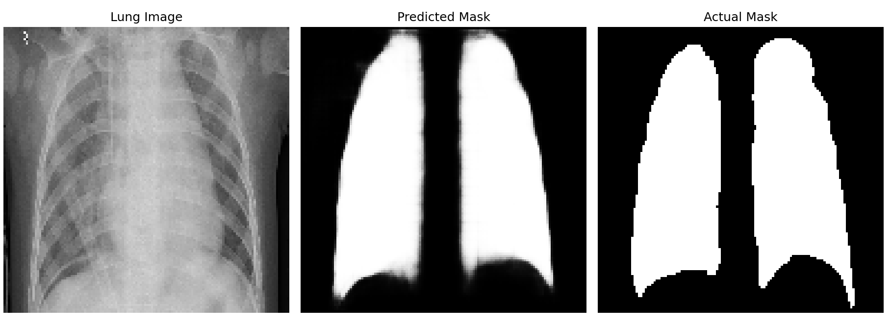

# U-ViT Lung Segmentation Model

## Overview
This model uses an U-shaped Vision Transformer (U-ViT) to semantically segment the lungs from x-ray images. It uses the encoder and decoder from a U-shaped Convolutional Network, [UNet](https://en.wikipedia.org/wiki/U-Net). Additionally, it is modified to have a Vision Transformer([ViT](https://en.wikipedia.org/wiki/Vision_transformer)) Bottleneck for optimal feature extraction. The Oxford-IIIT dataset is used for pretraining while a integrated lung dataset is used for fine-tuning. This model harnesses the global interpretation of a ViT and the localized biases of a UNet. 

## Features
- Combines a ViT and UNet. 
- Uses the Oxford-IIIt Pet Datset, and a integrated Lung Segmentation dataset (consists of Darwin, Montgomery, Shenzhen).
- Includes a dedicated analysis file.

## Highlights
- Achieved a **93.98%** Dice Coefficient and **88.64%** IoU (Jaccard) Score on Test dataset. 
- Utilizes a heavy augmentation-pipeline. 
- Excellent generalization using techniques such as Dropout and L2 Regularization.
- Uses OOP (Object-Oriented-Programming) for modularization.
- Uses [Transfer Learning](https://en.wikipedia.org/wiki/Transfer_learning) and model pretrained on Oxford-IIIt Pet Datset.
- Avoids Mask Sharpening for medical interprebility and transparency.

## Sample Prediction Image


## Getting Started 
### Dataset
Download the integrated dataset from [this website](https://data.mendeley.com/datasets/8gf9vpkhgy/2).  
For more information visit [DATASET_CITATION](https://github.com/IamArav2012/U_ViT-Lung-Segmentation-Model/blob/main/docs/DATASET_CITATION.md).

## Folder Management

The script creates a folder named `new_folder` (or any folder name you provide) in the current working directory to save the `.npy` dataset files.

- If the folder **does not exist**, it creates it.
- If the folder **already exists**, it deletes the entire folder and its contents, then creates a fresh new one before saving the files.

**Warning:** Any existing data in the folder will be permanently deleted when the script runs. Make sure to back up any important files before running.

### Installation 
```
git clone https://github.com/IamArav2012/U_ViT-Lung-Segmentation-Model.git
cd U_ViT-Lung-Segmentation-Model  
pip install -r requirements.txt  
```
### Usage
1. In *Lung_Segmentator.py* **replace** ```base_dir``` for the path to your folder.

2. Pretrain the model:
```python pre_training.py```

3. Fine-Tune the model:   
```python lung_segmentator.py```

4. Run Analyze_Results.py:
```python Analyze_Results.py```

## Project Structure
```
|- docs/                    # Documentation files, including dataset citation  
|- DATASET_CITATION.md      # Dataset citation details  
|- Analyze_Results.py       # Scripts to analyze model output  
|- Pretrain_segmentator.py  # Pretraining script  
|- FineTune_segmentator.py  # Fine-tuning script  
|- Lung_Segmentator.py      # Model architecture and helper functions  
|- requirements.txt         # Project dependencies  
|- README.md                # Project overview and usage  
|- .gitignore  
|- LICENSE                  # License details  
```
## License and Acknowledgments 
This project is licensed under the [MIT License](https://github.com/IamArav2012/U_ViT-Lung-Segmentation-Model/blob/main/LICENSE). This license encourages open collaboration. The model code and functions were created using the guidance of OpenAi's [ChatGPT](https://chatgpt.com/).  *Any advice and suggestions are welcome and encouraged. Any feedback is greatly appreciated!*