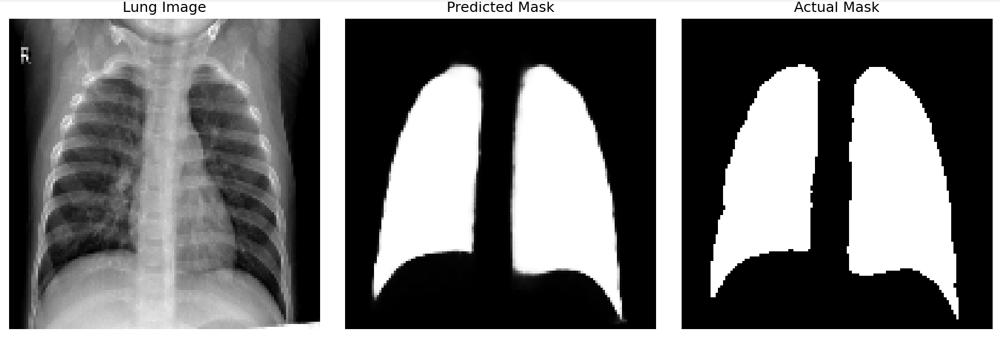

# Lung Segmentator: A Beginner-Friendly U-ViT Sandbox
A sandbox playground for computer vision beginners to safely explore deep learning segmentation models. 

## Overview
This repository is not meant to show off cutting-edge discoveries but rather to be a **framework for learners.** If you're a beginner who finds most GitHub repos overwhelming, this project is for you. This repository serves as a **starter kit** for experimentation and learning using modular code, clean integration, and easy debugging. 
It is built around a lightweight U-Net + Vision Transformer (U-ViT) architecture, making it easy to explore powerful models without needing advanced experience or expertise. 

## About the Initial Model
The base model uses an U-shaped Vision Transformer (U-ViT) to semantically segment the lungs from X-ray images. It combines the following:
- Encoder and decoder from a U-shaped Convolutional Network, [UNet](https://en.wikipedia.org/wiki/U-Net). 
- A Vision Transformer([ViT](https://en.wikipedia.org/wiki/Vision_transformer)) for optimal feature extraction. 
The Oxford-IIIT dataset is used for pretraining while an integrated lung dataset is used for fine-tuning.

## Project Structure
```
lung_segmentator/
├── __init__.py             # Entry point & config setup
├── pretraining.py          # Build and pretrain U-ViT
├── fine_tuning.py          # Fine-tune on new datasets
├── analysis.py             # Evaluate & visualize predictions
├── config.py               # Central config for easy tweaking
├── layers.py               # Houses reusable classes/layers

# Outside the package:

├── requirements.txt
├── pyproject.toml 
├── README.md
├── LICENSE
├── .gitignore
├── docs/                   # Contains dataset_citation and introduction
├── images/                 # Architecture diagrams and sample results
```

## Getting Started 
This section will help you setup everything you need to jump into this sandbox. It also includes information for how to begin experimenting. 

### Dataset
Download the integrated dataset from [this website](https://data.mendeley.com/datasets/8gf9vpkhgy/2).  
For more information visit [DATASET_CITATION](https://github.com/IamArav2012/SegPlay/blob/main/docs/DATASET_CITATION.md).

**Go to ```__init__.py``` and modify ```config.base_dir=``` to your base folder directory of the segmentation files. By default these files are named  ```Chest X-ray dataset for lung segmentation```, if they are downloaded from [10.17632/8gf9vpkhgy.2](https://data.mendeley.com/datasets/8gf9vpkhgy/2)**  
The following commands clone the repository using ```git```. If you don’t have Git installed, follow [this guide](https://github.com/git-guides/install-git).

## Philosophy
This project is designed with learning, customization, and experimentation in mind, not just usage. Unlike traditional Python packages that are installed and used without inspecting or altering their internal code, this repo is meant to be cloned, explored, and modified directly.

**Why not just pip install?**
Because that is not why this repo is built. 

This codebase is built like a Python package for modularity and clarity, but it’s not meant to be locked away behind an install command. You're encouraged to:

- Dive into the config.py and tweak hyperparameters.
- Modify layers, architectures, and training routines.
- Add your own experiments, ideas, or visualization techniques.   

What about ```pyproject.toml```?
Yes, a ```pyproject.toml``` is present, but mainly for advanced users who want to install this repo in “editable” mode using ```pip install -e .```. If you do this, you can run scripts as modules, e.g. ```python -m lung_segmentator.analysis```. *Again, direct edits are highly encouraged to reinforce learning through experimentation*.

Most users should not install this as a package. Instead:
- Clone the repo
- Edit the files directly
- Run scripts manually (python fine_tuning.py, python analysis.py, etc.)

**The recommended installation process is explained below in the *Installation* section**. 

# Installation
``` bash
# Clone the repo
git clone https://github.com/IamArav2012/SegPlay.git
cd SegPlay

# Note: The virtual environment step is optional but recommended to keep dependencies isolated.
python -m venv venv
source venv/bin/activate  # On Windows: venv\Scripts\activate

# Install dependencies
pip install -r requirements.txt

# Run fine-tuning (example)
python fine_tuning.py

# Run analysis (example)
python analysis.py

# To deactivate the virtual environment 
deactivate
```

### Folder Management
The script ```fine_tuning.py``` creates a folder named `npy_folder` (or any folder name you provide) in the current working directory to save the `.npy` dataset files. These `.npy` files ensure that testing images in ```analysis.py``` are unseen by the model. 

- If the folder **does not exist**, it creates it.
- If the folder **already exists**, it deletes the entire folder and its contents, then creates a fresh new one before saving the files.

**Warning:** Any existing data in the folder will be permanently deleted when the script runs. Make sure to back up any important files before running. 

## Learning by Doing
***Note: This section expects the user to have cloned this package***
Instead of passively reading tutorials, this repo encourages code tweaking and self-driven hands-on learning. 

Start by tweaking values in ```config.py```, or try replacing the ViT block with different architectures in ```pretraining.py```. ***For more information on utilizing this sandbox, visit [EXPERIMENTS.md](https://github.com/IamArav2012/SegPlay/blob/main/docs/EXPERIMENTS.md)***

## Initial Results
Despite this model being beginner-friendly, it achieves strong results. The following metrics are derived from an unseen test dataset:
- **94.04%** Dice Coefficient 
- **88.75%** IoU (Jaccard) Score      

These results are not state-of-the-art by any means, but they are a **solid baseline.** As I have already stated, the point of this repository is not to present a ground-breaking model, but to provide a simple but powerful resource to beginners.  

## Sample Prediction Image


## Contributing
If you're a beginner and this repo helped you, feel free to contribute:

- Add new architectures (e.g., ResNet, Swin, ConvNeXt)
- Add tutorials or learning walkthroughs
- Improve documentation

This is a sandbox.
***Try, Break, Learn, and Share.***

## License and Acknowledgments 
This project is licensed under the [MIT License](https://github.com/IamArav2012/U_ViT-Lung-Segmentation-Model/blob/main/LICENShttps://github.com/IamArav2012/SegPlay/blob/main/LICENSE). This license allows full reusability of the code, allowing exploration. The author built this with help from [OpenAI’s ChatGPT](https://chatgpt.com/), and is a self-taught enthusiast with no formal degree in deep learning, aiming to make the field more approachable for others.

## A Note From the Author 
"When I started learning deep learning, I wished for a place like this — not just a perfect model, but a sandbox where I could explore. I hope this helps make the field feel a little more approachable." 

## ⭐ If You Like This Project
If this repo helped you, consider **starring it** ⭐️ to help more learners discover it.  
Feel free to share it with friends, communities, or anyone getting started in machine learning.