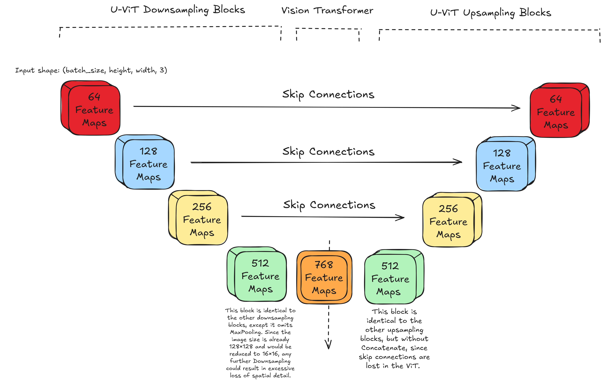
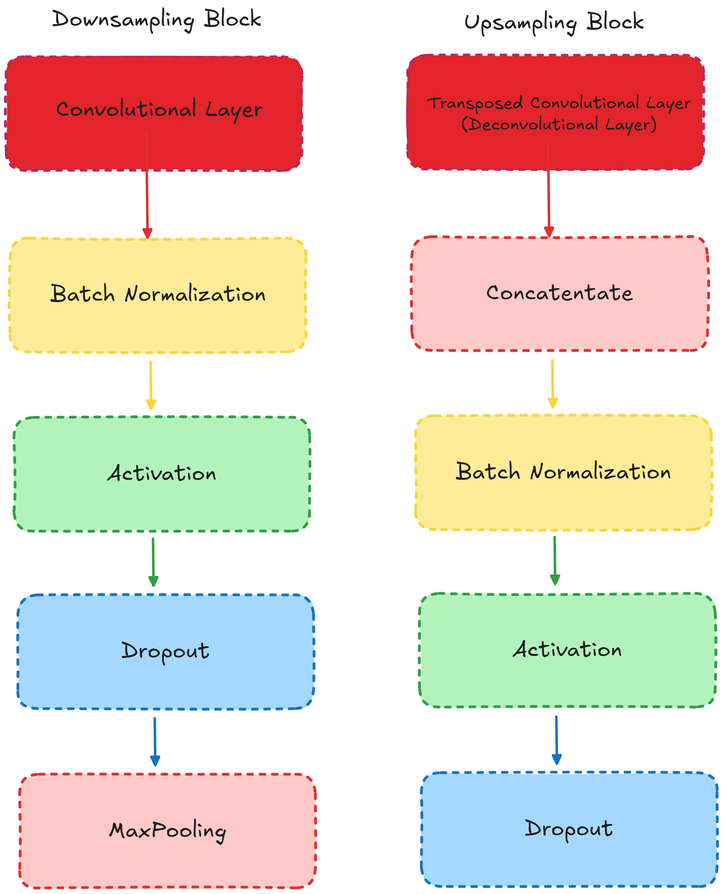

# Lung Segmentator: A Beginner-Friendly U-ViT Sandbox
A sandbox playground for beginners to safely explore deep learning segmentation models. 

## Overview
This repository is not meant to show off cutting-edge discoveries but rather to be a **framework for learners.** If you're a beginner who finds most GitHub repos overwhelming, this project is for you. This repository serves as a **starter kit** for experimentation and learning using modular code, clean integration, and easy debugging. 
*It is built around a lightweight U-Net + Vision Transformer (U-ViT) architecture.*

## About the Initial Model
The base model uses an U-shaped Vision Transformer (U-ViT) to semantically segment the lungs from X-ray images. It combines the following:
- Encoder and decoder from a U-shaped Convolutional Network, [UNet](https://en.wikipedia.org/wiki/U-Net). 
- A Vision Transformer([ViT](https://en.wikipedia.org/wiki/Vision_transformer)) for optimal feature extraction. 
The Oxford-IIIT dataset is used for pretraining while an integrated lung dataset is used for fine-tuning.

## Base Model Visualization

### Overall U-ViT Architecture 
  

This image demonstrates how `feature_maps` flow throughout the entire architecture, and how the entire model structured. 

### Downsampling and Upsampling Blocks


This image shows what each Downsampling and Upsampling block consists of. The `Concatenate` layer in the Upsampling block imitates a Skip Connection, used for recovering vital spatial context.

### Vision Transformer Bottleneck


This image highlights the difference between regular U-ViT architectures and this model. This model uses a system of ViT processing and concatentation to reflect a feasible increase in `feature_maps`.  

### Vision Transformer Block
  

This image displays the individual layers in the `Vision Transformer Block`. This block is typical of common ViT architectures adjusted slightly for the `Warnings` and `[Manual num_patches calculation]` operations. For more **insight** about the base architecture, visit [`introduction.md`](/docs/introduction.md). 

## Project Structure
```
lung_segmentator/
├── pretraining.py          # Build and pretrain U-ViT
├── fine_tuning.py          # Fine-tune on lung dataset
├── analysis.py             # Evaluate & visualize predictions
├── config.py               # Central config for easy tweaking
├── layers.py               # Houses reusable classes/layers

docs/                       # Contains important .md files
├── DATASET_CITATION.md
├── EXPERIMENTS.md
├── introduction.md

├── images/                 # Architecture diagrams and sample results
├── requirements.txt
├── README.md
├── LICENSE
├── .gitignore
```
## Philosophy

This project is not a package. It's not a library.  
It’s a **deep learning sandbox** — designed for **learning**, **experimentation**, and **customization**.
  
You clone it.  
You open it.  
You tweak it.  
You build on it.

The goal is to give you a modular and hackable environment to:
- Test architectures like U-Net, ViT, Swin, or hybrids.
- Modify layers and training pipelines.
- Prototype segmentation models on real-world datasets like chest X-rays.

***For more information on utilizing this sandbox, visit [EXPERIMENTS.md](/docs/EXPERIMENTS.md)***

## How to Use This Repo

There’s no need for setup beyond downloading the dataset:

1. Clone the repository  
2. Set the `base_dir` to your dataset path in `config.py`  
3. Run scripts like:

   ```bash
   python pretraining.py
    ```
    
All preprocessing, augmentation, and model logic are handled inside the scripts. This repo is intentionally kept lightweight and editable, so you can focus on:
- Rapid experimentation
- Architecture testing
- Learning how things work under the hood

**If you’re the kind of person who learns by building and breaking things, this repo was made for you.**

## Getting Started 
This section will help you setup everything you need to jump into this sandbox. It also includes information for how to begin experimenting. 

### Dataset
Download the chest X-ray lung segmentation dataset from [this Mendeley DOI](https://doi.org/10.17632/8gf9vpkhgy.2).  
For more information visit [DATASET_CITATION](/docs/DATASET_CITATION.md).

**In `config.py`, set the `base_dir` variable to your local path for the downloaded dataset. By default these files are named  `Chest X-ray dataset for lung segmentation`. The following commands clone the repository using `git`. If you don’t have Git installed, follow [this guide](https://github.com/git-guides/install-git).

### Folder Management
The script `fine_tuning.py` creates a folder named `npy_folder` (or any folder name you provide) in the current working directory to save the `.npy` dataset files. These `.npy` files ensure that testing images in `analysis.py` are unseen by the model. 

- If the folder **does not exist**, it creates it.
- If the folder **already exists**, it deletes the entire folder and its contents, then creates a fresh new one before saving the files.

**Warning:** Any existing data in the folder will be permanently deleted when the script runs. Make sure to back up any important files before running. 

## Installation

Follow these steps to install and run the project:

1. Clone the repository and navigate into it:

   ```bash
   git clone https://github.com/IamArav2012/SegPlay.git
   cd SegPlay
   ```

2. (Optional but recommended) Create and activate a virtual environment:

   ```bash
    # Create Virtual Environment
    python3 -m venv venv     # Linux/Mac
    python -m venv venv      # Windows

    # Activate Virtual Environment
    source venv/bin/activate  # Linux/Mac
    venv\Scripts\activate     # Windows
   ```

3. Install the required dependencies:

   ```bash
   pip install -r requirements.txt
   ```

4. Run `pretraining.py` (example):     

   ```bash
   python pretraining.py
   ```

5. Run `fine_tuning` (example):

   ```bash
   python fine_tuning.py
   ```

6. To deactivate the virtual environment:

   ```bash
   deactivate
   ```

## Initial Results
*Despite this model being beginner-friendly, it achieves strong results*. The following metrics are derived from an unseen test dataset:
- **95.51%** Dice Coefficient 
- **91.41%** IoU (Jaccard) Score      

***These results are not state-of-the-art by any means, but they are a solid baseline.*** As I have already stated, the point of this repository is not to present a ground-breaking model, but to provide a simple but powerful resource to beginners. *If you'd like to download the base model `.keras` file that achieved these results, please use the links below:*
- [Pretraining Model](https://drive.google.com/file/d/1gxOX0LWoYmEtRuCmoxqrJDYcpxPr9DVU/view)
- [Lung Segmentator](https://drive.google.com/file/d/1VE_HQKiwgFNQVuIUrxRwfLlGiOAbOfTI/view)  

The `npy_folder` will not be provided, as `.npy` files could not be reliably transferred via Google Drive. Downloads were often unsuccessful or resulted in corrupted files.

## Sample Prediction Image


## Contributing
If you're a beginner and this repo helped you, feel free to contribute:

- Add new architectures (e.g., ResNet, Swin, ConvNeXt)
- Add tutorials or learning walkthroughs
- Improve documentation

This is a sandbox.
***Try, Break, Learn, and Share.***

## License and Acknowledgments 
This project is licensed under the [MIT License](/LICENSE). This license allows full reusability of the code, allowing exploration. The author is a self-taught enthusiast with no formal degree in deep learning, aiming to make the field more approachable for others. The author built this entire repository with help from [OpenAI’s ChatGPT](https://chatgpt.com/) for ideas and polishing. 

## A Note From the Author 
"When I started learning deep learning, I wished for a place like this — not just a perfect model, but a sandbox where I could explore. I hope this helps make the field feel a little more approachable." 

## ⭐ If You Like This Project
If this repo helped you, consider **starring it** ⭐️ to help more learners discover it.  
Feel free to share it with friends, communities, or anyone getting started in machine learning.