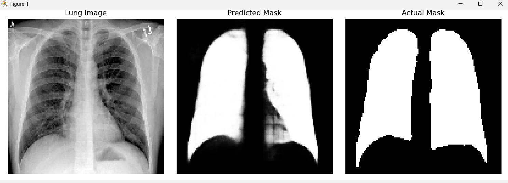
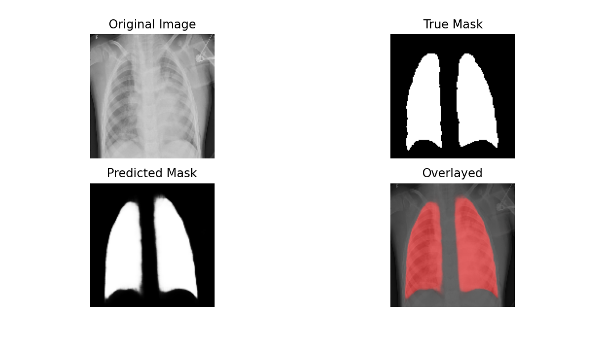

# Introduction

## Prerequisites
This document assumes the reader has a foundational understanding of machine learning concepts such as **overfitting, hyperparameters, fine-tuning, regularization,** and **activation functions**. Familiarity with architectures like **U-Net** and **Transformers**, as well as with the **medical applications of computer vision models**, will also aid comprehension.

## Table of Contents
- [Overview](#overview)
- [Motivation](#motivation)
- [Dataset](#dataset)
- [Model Architecture](#model-architecture)
  - [U-ViT Architecture](#overall-u-vit-model-architecture)
  - [ViT Bottleneck](#vit-bottleneck)
  - [Patchify and PatchEncoder](#patchify-and-patchencoder)
- [Training Setup](#training-setup)
- [Results and Analysis](#results-and-analysis)
- [References](#references)

## Overview
The project implements a **U-ViT** (U-Shaped Vision Transformer) for accurate segmentation of the lungs in Chest X-ray images. This model aims to assist in the diagnosis of diseases and other abnormalities in the pulmonary domain. This is a recreation of a popular project among learners and is purely done for educational and documentation purposes.   

## Motivation
This model was created for educational value and is open-source for anyone to contribute. The U-ViT technology used in this model is still relatively new, first developed by [Wang, Z., Cun, X., Bao, J., Zhou, W., Liu, J., & Li, H. (2022)](https://openaccess.thecvf.com/content/CVPR2022/papers/Wang_Uformer_A_General_U-Shaped_Transformer_for_Image_Restoration_CVPR_2022_paper.pdf). This model serves as a resource and reference point for beginners. 

## Dataset 
Two datasets were used to train this model:
- Oxford_IIT Pet Dataset
- Integrated Lung Segmentation Dataset (Darwin, Montgomery, and Shenzhen)  

Refer to [DATA_CITATION.md](https://github.com/IamArav2012/U_ViT-Lung-Segmentation-Model/blob/main/docs/DATASET_CITATION.md) for additional details. 

## Model Architecture 
This model uses the downsampling and upsampling blocks of a Unet and a ViT encoder as the bottleneck of the architecture.

### Overall U-ViT Model Architecture   
```
Downsampling block (3x)
 ↓
Downsampling block (No Pooling)
 ↓
ViT Block (Encoder)
 ↓
Upsampling block (No Concatenation)
 ↓
Upsampling block (3x)
 ↓
Output layer (Sigmoid Activation)
```
#### Downsampling block
```
Conv2d()
BatchNormalization()
Activation()
Dropout() 
MaxPooling2D()
```

#### Upsampling Block 
```
Conv2DTranspose()
Concatenate() 
BatchNormalization() 
Activation() 
Dropout()
```
There is one downsampling block and one upsampling block in the architecture which are inconsistent with their respective counterparts. This is because the feature maps would already have dimensions of ```(16, 16)``` and decreasing the dimensions would run the risk of having ```feature_maps``` which are ineffective for comprehensive results. Moreover, more ```feature_maps``` are needed since 256 feature maps are relatively low for such a segmentation model. The solution is to use an extra downsampling and upsampling block with no ```MaxPooling2D()``` and ```Concatenate()``` respectively.

### Unet encoder: 
- Convolutional Layer  
    - Each downsampling block contains a ```Conv2D``` layer. It uses kernels, a set of weights, and slides it directly onto the input image(s), producing feature maps. In my case, the feature maps double every encoder block since it is common practice and the numbers are simple to manipulate. Increasing feature maps too quickly can cause degraded-quality feature maps while increasing feature maps too slowly can result in a model that has unnecessary computational cost. The padding is set to ```'same'``` for consistent dimensions, important for skip connections (```Concatenate()```). A ```l2 regularization``` is added to prevent overfitting as it is a primary method to reset excessive weights. In my model, I use a l2 regularization of ```kernel_regularizer=0.001``` as it is generally a good starting point. For more information about Convolutional layers, visit [*U-Net: Convolutional Networks for Biomedical Image Segmentation*](https://arxiv.org/pdf/1505.04597).
- Max Pooling    
    - A Max Pooling (```MaxPooling2D()```) layer uses a technique called "pooling" to downsample images by a certain amount, contingent on hyperparameters like ```pool_size``` and ```strides```. In the model, a ```pool_size=2``` is used, and ```strides``` is not explicitly defined since, by default, ```strides``` is set equal to the ```pool_size``` unless defined otherwise. I use a ```MaxPooling2D()``` layer in each downsampling block, and the corresponding ```Conv2dTranspose()``` and ```Concatentate()``` layers. Max Pooling is significant because it allows convolutional layers to effectively have a "larger" receptive field since they extract the maximum value from each pool, allowing deeper pattern recognition as model depth increases. To learn more, visit the classic novel paper [*ImageNet Classification with Deep Convolutional Neural Networks*](https://proceedings.neurips.cc/paper_files/paper/2012/file/c399862d3b9d6b76c8436e924a68c45b-Paper.pdf). 

### ViT bottleneck
The exact architecture is: 
```
Patchify()
PatchEncoder()

MultiHeadAttention block:
 LayerNormalization()
 MultiHeadAttention()
 Add()
 LayerNormalization()
 Mlp()
 Add()
```

1. Patchify and PatchEncoder  
    - These are explained thoroughly in the [**Patchify and PatchEncoder**](#patchify-and-patchencoder) section below. 

2. LayerNormalization 
    - Layer Normalization is a version of ```Batch_Normalization``` that was first used in [*Layer Normalization*](https://arxiv.org/pdf/1607.06450). Layer Normalization works identically to batch_normalization except that it calculates mean and standard deviation for each feature and adjusts them separately instead of operating with averaged values among the entire batch. It is important to note that the features are not directly divided by standard deviation, but the square root of it. In my case, I used ```epsilon = 10e-6``` to avoid a division by 0 error and to stabilize gradients. For more about batch_normalization visit the **BatchNormalization** section below. 
 
3. MultiHeadAttention  
    - ```MultiHeadAttention``` is used in all modern transformers to help generalization and quicken convergence. It was first used in [*Attention Is All You Need*](https://arxiv.org/pdf/1706.03762). ```layers.MultiHeadAttention(num_heads=attention_heads, key_dim=projection_dims, dropout=0.1)``` in the code for modularity and to avoid hard-coding. Dropout in this stage helps to combat overfitting. 
4. Add  
    - This is a residual layer used for preventing [vanishing gradients](https://en.wikipedia.org/wiki/Vanishing_gradient_problem). The ```Add()``` is used after all major layers like the Mlp and MultiHeadAttention. This layer was derived from the ResNET architecture which was first implemented in [*Deep Residual Learning for Image Recognition*](https://arxiv.org/pdf/1512.03385).
5. Mlp 
    - This is a version of a FFN([Feedforward_Neural_Network](https://en.wikipedia.org/wiki/Feedforward_neural_network)). It uses dense and dropout layers to expand and condense the data for optimal feature extraction. This also ensures shape compatibility.

### U-Net Decoder
1. Conv2DTranspose  
    - ```Conv2DTranspose()``` uses **Transposed Convolution**, also known as **Deconvolution**, to effectively reverse the effect of convolutional layers. This is a ```Conv2d()```and ```UpSampling()``` inspired layer which essentially uses a learned upsampling operation using kernels. Mathematically, it reverses the effect of a Conv2D by "spreading out" the values. This is superior to ```UpSampling``` because it learns kernel weights, similar to how ```Conv2D``` layers do. **It is crucial to clarify that ```Conv2DTranspose``` doesn't literally invert the effect on ```Conv2D()``` but instead performs a learned upsampling**.  This mechanism was first developed in [*Fully Convolutional Networks for Semantic Segmentation*](https://arxiv.org/pdf/1605.06211v1). Furthermore, to fully understand this concept the paper [*A Guide to Convolution Arithmetic for Deep Learning*](https://arxiv.org/pdf/1603.07285) is also recommended.  
 
2. Concatenate  
    - The function ```Concatenate``` is used as [Skip Connections](https://medium.com/@preeti.gupta02.pg/understanding-skip-connections-in-convolutional-neural-networks-using-u-net-architecture-b31d90f9670a) to refactor the encoder's feature maps into consideration. The idea of skip connections was first used in the original U-Net paper [*U-Net: Convolutional Networks for Biomedical Image Segmentation*](https://arxiv.org/pdf/1505.04597). 

3. ```Conv2D(1, 1, activation='sigmoid')```
    - This layer uses a **1 by 1 kernel** and the ```'sigmoid'``` activation to generate pixel by pixel mask predictions. The 1 by 1 kernel ensures the mask has the same spatial dimensions as the input image since it has already been upsampled to appropriate dimensions ```(128 by 128)```. Additionally, the ```sigmoid``` activation function, in this case, mainly saturates the output into a range from 0 to 1 to make the mask interpretable.

### Common Layers Used Across Architecture  
These layers will be more thoroughly explained as they are universal not just to this architecture, but to almost all Deep-Learning Neural Networks. 

1. Batch Normalization  
    - ```BatchNormalization()``` uses a process of subtracting the mean of the data and dividing by the square root of the standard deviation. Then the output is scaled and shifted, meaning learnable multiplication and addition operations occur. This essentially eliminates a problem in neural networks called [Internal Covariate Shift](https://en.wikipedia.org/wiki/Batch_normalization). This idea was originally introduced by the paper, [*Batch Normalization: Accelerating Deep Network Training by Reducing Internal Covariate Shift*](https://arxiv.org/pdf/1502.03167.). Batch Normalization has inspired many other types of Normalization layers including LayerNorm, InstanceNorm, GroupNorm, and SpectralNorm.  
2. Activation  
    - An activation function, as the name suggests, applies an activation to the input. There are innumerable activation functions but the ones used in my model are ```'gelu'``` and, primarily, ```'relu'```. The ReLU function is characterized by the equation ```f(x) = max(0, x)```, and it works to remove negative values from the network while preserving the positive values. This function was a breakthrough in modern machine learning since previously tanh(x) was used which saturated positive values, not just negative ones. The ```GELU``` activation function also works to saturate negative values but rather than eliminating them, it incorporates small negative values in the neural network, helping very deep models like [**BERT**](https://huggingface.co/docs/transformers/en/model_doc/bert) and [**GPT**](https://zapier.com/blog/what-is-gpt/). In my model, ReLU is implemented everywhere since it is computationally inexpensive and considered good practice. In contrast, GELU is only used once, in the **mlp** unit of the transformer layer since ```mlp()``` is vital to extract superlative features.  
3. Dropout  
    - ```Dropout()``` is a technique introduced by [*A Simple Way to Prevent Neural Networks from Overfitting*](https://jmlr.org/papers/volume15/srivastava14a/srivastava14a.pdf). It randomly disables a percentage  (```dropout_rate```) of activations in a layer forcing the model to learn redundant and comprehensive representations. This is an anti-overfitting technique that improves generalization, similar to ```regularization``` but utilizing nuanced methodology. I use different dropout rates in my ```pass_through_vit()```,  ```build_uvit()```, and ```mlp()``` ranging from 0.1 (10%) to 0.35 (35%) depending on how crucial the operation is for overfitting.  

## Training Setup 
### Pretrain_segmentator.py
#### Data Preparation
The Oxford_IIT dataset is loaded from ```tensorflow_datasets``` by using the ```.load()``` attribute. This script utilizes the ```preprocess()``` and ```augment()``` functions to prepare the Oxford-IIT data for training, validation, and testing. The data is split using ```train_test_spilt()``` and manually converted into a ```tf.data.Dataset``` for faster training and CPU/GPU optimization. These datasets are independently batched, prefetched, and augmented according to best practices. 

#### Patchify and PatchEncoder
This model uses custom classes named ```Patchify``` and ```PatchEncoder``` to integrate the output of the U-Net's downsampling block with the ViT architecture. These classes are decorated with ```@register_keras_serializable()``` for seamless loading into the ```Lung_Segmentator.py``` script. The ```Patchify``` class uses ```tf.extract_patches``` to extract patches from the feature maps, and it also reshapes the input from ```(batch_size, img_height, img_width, feature_maps)``` to ```(batch_size, img_size, patch_dims)```. The values of ```feature_maps``` and ```patch_dims``` remain numerically unchanged, but the variables are renamed for conceptual clarity. The class ```PatchEncoder``` performs a linear transformation and provides ```positional_embedding``` for spatial context. It converts the 'pixel values' into resized vectors for ViT processing, and then it adds the positional embeddings directly to the vectors. The positional embeddings are derived from a learned ```layers.Embedding``` layer that takes indices as its input. The ```Embedding``` layer does not produce values in a sinusoidal manner by using ```sin(x)``` and ```cos(x)``` like it does in [NLP Transformers](https://en.wikipedia.org/wiki/Transformer_(deep_learning_architecture)), but rather uses a *trainable layer* to generate ```positional_embeddings```.

### Lung_Segmentator.py
This script uses a ```load_and_preprocess()``` function and an augment function, similar to ```pretrain_segmentator script.``` The main difference is that the ```os``` module is being used to directly load from the hard drive, and we are using stronger augmentation ([Gaussian Distribution](https://en.wikipedia.org/wiki/Normal_distribution)). This script uses ```tf.keras.models.load_model``` to directly load the ```pretrained_segmentator_weights.keras``` file as initialized weights. The ```LEARNING_RATE``` has been decreased for fine-tuning, and ```Early_Stopping``` is similarly implemented. A ```combined_loss``` function is used which combines a weighted sum of ```dice_loss``` and ```binary_crossentropy``` from a balanced ratio of 0.65:0.35 respectively.   

## Results and Analysis

### Metrics:
- Dice Coefficient: ***0.9398***
- Dice Loss: 0.0602
- IoU (Intersection over Union): ***0.8864***
- Pixel Accuracy: ***0.9615***
- Binary-Crossentropy Loss: 0.1022

### Visualization:
#### Easy Segmentation Image  

#### Difficult Segmentation Image  

#### Overlay Map    


## References