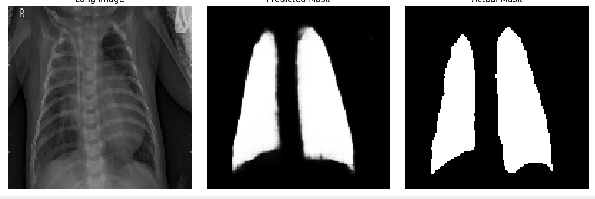

# Introduction

## Prerequisites
This document assumes the reader has a foundational understanding of machine learning concepts such as **overfitting, hyperparameters, fine-tuning, regularization,** and **activation functions**. Familiarity with architectures like **U-Net** and **Transformers**, as well as with the **medical applications of computer vision models**, will also aid comprehension. *While familiarity with U-Net and Transformers is beneficial, it is not a strict requirement for understanding this document.* 

## Table of Contents
- [Overview](#overview)
- [Motivation](#motivation)
- [Dataset](#dataset)
- [Model Architecture](#model-architecture)
  - [U-ViT Architecture](#overall-u-vit-model-architecture)
  - [ViT Bottleneck](#vit-bottleneck)
- [Training Setup](#training-setup)
- [Results and Analysis](#results-and-analysis)
- [References](#references)

## Overview
This document aims to explain the base model which implements a **U-ViT** (U-Shaped Vision Transformer) for accurate segmentation of the lungs in Chest X-ray images. This model aims to assist in the diagnosis of diseases and other abnormalities in the pulmonary domain. **As detailed in the ```README```, this model serves as a baseline; experiments and customization are highly encouraged. For additional guidance, see [```EXPERIMENTS.md```](https://github.com/IamArav2012/SegPlay/blob/main/docs/EXPERIMENTS.md)**. This implementation replicates a popular educational project among learners and is done only for educational and documentation purposes.   

## Motivation
The base model was created for educational purposes and is open-source for anyone to contribute. The U-ViT technology used in this model is still relatively new, first developed by [Wang, Z., Cun, X., Bao, J., Zhou, W., Liu, J., & Li, H. (2022)](https://openaccess.thecvf.com/content/CVPR2022/papers/Wang_Uformer_A_General_U-Shaped_Transformer_for_Image_Restoration_CVPR_2022_paper.pdf). *This project was motivated by the lack of easy-to-use resources for safely experimenting with different architectural designs, particularly during the early stages of computer vision research.* ***This project aims to provide real-world value to beginners by moving beyond introductory experimentation with datasets like MNIST.*** **For this reason, the functions and classes in this package are written to emphasize clarity and modularity. Moreover, the augmentation pipeline structure and Keras serialization have been proactively handled.**

## Dataset 
Two datasets were used to train this model:
- Oxford_IIT Pet Dataset
- Integrated Lung Segmentation Dataset (Darwin, Montgomery, and Shenzhen)  

Refer to [DATA_CITATION.md](https://github.com/IamArav2012/SegPlay/blob/main/docs/DATASET_CITATION.md) for additional details. 

## Model Architecture 
The base model uses the downsampling and upsampling blocks of a Unet and a ViT encoder as the bottleneck of the architecture.

### Overall U-ViT Model Architecture   
```
Downsampling block (3x)
 ↓
Feature Extraction block (without MaxPooling)
 ↓
ViT Block (Encoder)
 ↓
Upsampling block (without Concatenation)
 ↓
Upsampling block (3x)
 ↓
Output layer (Sigmoid Activation)
```
#### Downsampling Block
```
Conv2D()
BatchNormalization()
Activation()
Dropout() 
MaxPooling2D()
```

#### Upsampling Block 
```
Conv2DTranspose()
Concatenate() 
BatchNormalization() 
Activation() 
Dropout()
```

#### Feature Extraction Block (Modified Downsampling block)
```
Conv2D()
BatchNormalization()
Activation()
Dropout()
(no MaxPooling)
```

#### Initial Upsampling Block (Modified upsampling block)
```
Conv2DTranspose()
(no Concatenate)
BatchNormalization()
Activation()
Dropout()
```  
#### Explanation  
1. The model applies three conventional downsampling blocks that reduce spatial dimensions (```MaxPooling()```), increasing feature map depth and extracting superlative features.

2. Instead of a fourth downsampling block with ```MaxPooling()```, a feature extraction block without spatial reduction is used to maintain a spatial size of 16×16. This prevents overly compressing the spatial dimensions before the ViT block, which relies on sufficient spatial resolution for patch-based attention.

3. The ViT block acts as a bottleneck, processing these feature maps without changing their spatial resolution. *ViT blocks **can** change spatial resolution, but in this implementation, it does not.*

4. On the decoder side, the first upsampling block restores spatial resolution, but does not concatenate features from the encoder. This happens because the ViT block represents a bottleneck without skip connections.

5. Subsequent upsampling blocks follow the usual pattern, concatenating corresponding encoder feature maps to recover fine-grained details and spatial context.

6. Additionally, the model increases the number of feature maps before the ViT block to compensate for reduced spatial information, enabling better capture of complex features crucial for precise segmentation.

### U-Net Encoder: 
- Convolutional Layer  
    - Each downsampling block contains a ```Conv2D``` layer. It uses kernels, a set of weights, and slides it directly onto the input image(s), producing feature maps. In this case, the feature maps double every encoder block following common practice, allowing effortless numerical manipulation. Increasing feature maps too quickly can cause degraded-quality feature maps while increasing feature maps too slowly can result in a model that has unnecessary computational cost. The padding is set to ```'same'``` for consistent dimensions, important for skip connections (```Concatenate()```). A ```l2 regularization``` is added to promote generalization and prevent overfitting by penalizing large weights, encouraging the model to learn simpler patterns. In the model, a L2 regularization of ```kernel_regularizer=0.001``` is implemented as it is generally a good starting point. For more information about Convolutional layers, visit [*U-Net: Convolutional Networks for Biomedical Image Segmentation*](https://arxiv.org/pdf/1505.04597).
- Max Pooling    
    - A Max Pooling (```MaxPooling2D()```) layer uses a technique called "pooling" to downsample images by a certain amount, contingent on hyperparameters like ```pool_size``` and ```strides```. In the model, a ```pool_size=2``` is used, and ```strides``` is not explicitly defined since, by default, ```strides``` is set equal to the ```pool_size``` unless defined otherwise. A ```MaxPooling2D()``` layer is used in each downsampling block, as well as there corresponding ```Conv2DTranspose()``` and ```Concatenate()``` layers. Max Pooling is significant because it allows convolutional layers to effectively have a "larger" receptive field since they extract the maximum value from each pool, allowing deeper pattern recognition as model depth increases. To learn more, visit the classic novel paper [*ImageNet Classification with Deep Convolutional Neural Networks*](https://proceedings.neurips.cc/paper_files/paper/2012/file/c399862d3b9d6b76c8436e924a68c45b-Paper.pdf). 

### ViT Bottleneck
The exact architecture is: 
```
InputValidator.validate_pass_through_vit()
[Num_patches Calculation]
Patchify()
PatchEncoder()

MultiHeadAttention block:
 LayerNormalization()
 MultiHeadAttention()
 Add()
 LayerNormalization()
 Mlp()
 Add()
```
1. InputValidator.validate_pass_through_vit()
    - **The ```InputValidatior``` class is designed to centralize the warnings of all architecture blocks both current and future.** For now, it only houses warnings of the ```pass_through_vit()``` function. This line calls the ```validate_pass_through_vit()``` method, which raises ```ValueError```s to make sure the block does not fail quietly or behave unexpectedly.

2. Patchify  
    - This custom class named ```Patchify``` integrates the output of the U-Net's downsampling block with the ViT architecture. This class leverages TensorFlow’s ```tf.extract_patches``` to generate patches from the feature maps. Patches of size 4×4  are extracted, resulting in 16 patches for ViT processing. Likewise, it also reshapes the input from ```(batch_size, img_height, img_width, feature_maps)``` to ```(batch_size, img_size, patch_dims)```. The values of ```feature_maps``` and ```patch_dims``` remain numerically unchanged, but the variables are renamed for conceptual clarity.

3. PatchEncoder  
    - This is a custom class named ```PatchEncoder``` which performs a linear transformation and provides ```positional_embedding``` for spatial context, to the patch embeddings. It converts the patch pixel values into vector embeddings for ViT processing, then adds learned positional embeddings to provide spatial context to the model. The positional embeddings are derived from a learned ```layers.Embedding``` layer that takes indices as its input. The ```Embedding``` layer does not produce values in a sinusoidal manner by using ```sin(x)``` and ```cos(x)``` like it does in [NLP Transformers](https://en.wikipedia.org/wiki/Transformer_(deep_learning_architecture)), but rather uses a *trainable layer* to generate ```positional_embeddings```.

4. LayerNormalization 
    - Layer Normalization is a version of ```Batch_Normalization``` that was first used in [*Layer Normalization*](https://arxiv.org/pdf/1607.06450). Layer Normalization works identically to batch_normalization except that it calculates mean and standard deviation for each feature and adjusts them separately instead of operating with averaged values among the entire batch. The bases model includes ```epsilon = 10e-6``` to avoid a division by 0 error and to stabilize gradients. For more about batch_normalization visit the **BatchNormalization** section below. 
 
5. MultiHeadAttention  
    - ```MultiHeadAttention``` is used in all modern transformers to help generalization and quicken convergence. It was first used in [*Attention Is All You Need*](https://arxiv.org/pdf/1706.03762). ```layers.MultiHeadAttention(num_heads=attention_heads, key_dim=projection_dims, dropout=0.1)``` in the code for modularity and to avoid hard-coding. Dropout in this stage helps to combat overfitting. 
6. Add  
    - This is a residual layer used for preventing [vanishing gradients](https://en.wikipedia.org/wiki/Vanishing_gradient_problem). The ```Add()``` is used after all major layers like the Mlp and MultiHeadAttention. This layer was derived from the ResNET architecture which was first implemented in [*Deep Residual Learning for Image Recognition*](https://arxiv.org/pdf/1512.03385).
7. Mlp 
    - This is a version of a FFN([Feedforward_Neural_Network](https://en.wikipedia.org/wiki/Feedforward_neural_network)). It uses dense and dropout layers to expand and condense the data for optimal feature extraction. This also ensures shape compatibility.

### U-Net Decoder
1. Conv2DTranspose  
    - ```Conv2DTranspose()``` uses **Transposed Convolution**, also known as **Deconvolution**, to effectively reverse the effect of convolutional layers. This is a ```Conv2D()```and ```UpSampling()``` inspired layer which essentially uses a learned upsampling operation using kernels. Mathematically, it reverses the effect of a ```Conv2D()``` by "spreading out" the values. This is superior to ```UpSampling``` because it learns kernel weights, similar to how ```Conv2D``` layers do. **It’s worth noting that ```Conv2DTranspose``` isn’t a true inverse of ```Conv2D```; instead, it learns to upsample in a way that roughly reverses the original operation.**  This mechanism was first developed in [*Fully Convolutional Networks for Semantic Segmentation*](https://arxiv.org/pdf/1605.06211v1). Furthermore, to fully understand this concept the paper [*A Guide to Convolution Arithmetic for Deep Learning*](https://arxiv.org/pdf/1603.07285) is also recommended.  
 
2. Concatenate  
    - The function ```Concatenate``` is used to implement [Skip Connections](https://medium.com/@preeti.gupta02.pg/understanding-skip-connections-in-convolutional-neural-networks-using-u-net-architecture-b31d90f9670a) to refactor the encoder's feature maps into consideration. The idea of skip connections was first used in the original U-Net paper [*U-Net: Convolutional Networks for Biomedical Image Segmentation*](https://arxiv.org/pdf/1505.04597). 

3. ```Conv2D(1, 1, activation='sigmoid')```
    - This layer uses a **1 by 1 kernel** and the ```'sigmoid'``` activation to generate pixel by pixel mask predictions. The 1 by 1 kernel ensures the mask has the same spatial dimensions as the input image since it has already been upsampled to appropriate dimensions ```(128 by 128)```. Additionally, the ```sigmoid``` activation function, in this case, mainly saturates the output into a range from 0 to 1 to make the mask interpretable.

### Common Layers Used Across Architecture  
These layers will be more thoroughly explained as they are universal not just to this architecture, but to almost all Deep-Learning Neural Networks. 

1. Batch Normalization  
    - ```BatchNormalization()``` uses a process of subtracting the mean of the data and dividing by the square root of the standard deviation. Then the output is scaled and shifted, meaning learnable multiplication and addition operations occur. This essentially eliminates a problem in neural networks called [Internal Covariate Shift](https://en.wikipedia.org/wiki/Batch_normalization). This idea was originally introduced by the paper, [*Batch Normalization: Accelerating Deep Network Training by Reducing Internal Covariate Shift*](https://arxiv.org/pdf/1502.03167). Batch Normalization has inspired many other types of Normalization layers including LayerNorm, InstanceNorm, GroupNorm, and SpectralNorm.  
2. Activation  
    - An activation function, as the name suggests, applies an activation to the input. There are innumerable activation functions but the ones used here are ```'gelu'``` and, primarily, ```'relu'```. The ReLU function is defined as ```f(x) = max(0, x)```, zeroing out negative inputs while keeping positive inputs unchanged. It was a breakthrough because it avoids saturation in positive values, unlike previously common functions like tanh(x). The ```GELU``` activation function also works to saturate negative values but rather than eliminating them, it incorporates small negative values in the neural network, helping exceptionally deep models like [**BERT**](https://huggingface.co/docs/transformers/en/model_doc/bert) and [**GPT**](https://zapier.com/blog/what-is-gpt/). ReLU is applied consistently across the model for its efficiency and reliability, while GELU is reserved for the ```mlp()``` unit in the transformer to better capture non-linear features.”
      
3. Dropout  
    - ```Dropout()``` is a technique introduced by [*A Simple Way to Prevent Neural Networks from Overfitting*](https://jmlr.org/papers/volume15/srivastava14a/srivastava14a.pdf). It randomly disables a percentage  (```dropout_rate```) of activations in a layer forcing the model to learn redundant and comprehensive representations. This is an anti-overfitting technique that improves generalization, similar to ```regularization``` but utilizing nuanced methodology. Different dropout rates are used in ```pass_through_vit()```,  ```build_uvit()```, and ```mlp()``` ranging from 0.1 (10%) to 0.35 (35%) depending on how crucial the operation is for overfitting.  

## Training Setup 
### pretraining.py
#### Data Preparation
The Oxford_IIT dataset is loaded from ```tensorflow_datasets``` by using the ```.load()``` attribute. This script utilizes the ```preprocess()``` and ```augment()``` functions to prepare the Oxford-IIT data for training, validation, and testing. The data is split using ```train_test_spilt()``` and manually converted into a ```tf.data.Dataset``` for faster training and CPU/GPU optimization. These datasets are independently batched, prefetched, and augmented according to best practices. 

### fine_tuning.py
This script uses a ```load_and_preprocess()``` function and an augment function, similar to ```pretrain_segmentator script.``` The main difference is that the ```os``` module is being used to directly load from the hard drive, and we are using stronger augmentation ([Gaussian Distribution](https://en.wikipedia.org/wiki/Normal_distribution)). This script uses ```tf.keras.models.load_model``` to directly load the ```pretrained_segmentator_weights.keras``` file as initialized weights. The ```LEARNING_RATE``` has been decreased for fine-tuning, and ```Early_Stopping``` is similarly implemented. A ```combined_loss``` function is used which combines a weighted sum of ```dice_loss``` and ```binary_crossentropy``` from a balanced ratio of 0.65:0.35 respectively. During training, three additional callbacks were used to improve convergence:

1. EarlyStopping monitors ```'val_dice_coef'```, which is computed using non-augmented validation images. A ```min_delta=0.001``` ensures the model must improve by at least this margin to reset patience.

2. ```ReduceLROnPlateau``` is configured with ```factor=0.5```, ```patience=3```, and ```min_lr=1e-6```, allowing for adaptive learning rate reductions when validation performance plateaus.

3. ```ModelCheckpoint``` saves the best model based on ```'val_dice_coef'``` to prevent overfitting or divergence in later epochs, which may occur due to the forgiving nature of the implemented ```EarlyStopping``` callback.

### Serialization
These classes are decorated with ```@register_keras_serializable()``` to ensure they can be seamlessly loaded by the ```fine_tuning.py``` and ```analysis.py``` modules. The functions are loaded using ```tensorflow.keras.models.load_model()```, which relies on the ```custom_objects``` argument. To keep everything robust and consistent, the ```custom_objects``` function also includes these classes.

## Results and Analysis
### Metrics:
- Dice Coefficient: ***0.9404***
- Dice Loss: 0.0596
- IoU (Intersection over Union): ***0.8875***
- Pixel Accuracy: ***0.9622***
- Binary-Crossentropy Loss: 0.1024

### Visualization:
#### Easy Segmentation Image  

#### Difficult Segmentation Image  

#### Overlay Map    
</img>

## References
1. Z. Wang, X. Cun, J. Bao, J. Zhang, J. Liu, C. Shen, and Q. Chen, “Uformer: A general U-shaped transformer for image restoration,” in Proc. IEEE/CVF Conf. Comput. Vis. Pattern Recognit. (CVPR), 2022, pp. 17662–17672. [Online]. Available: https://doi.org/10.1109/CVPR52688.2022.01716

2. O. Ronneberger, P. Fischer, and T. Brox, “U-Net: Convolutional networks for biomedical image segmentation,” in Med. Image Comput. Comput.-Assist. Interv. – MICCAI 2015, vol. 9351, N. Navab, J. Hornegger, W. M. Wells, and A. F. Frangi, Eds. Springer, 2015, pp. 234–241. [Online]. Available: https://doi.org/10.1007/978-3-319-24574-4_28

3. A. Krizhevsky, I. Sutskever, and G. E. Hinton, “ImageNet classification with deep convolutional neural networks,” Commun. ACM, vol. 60, no. 6, pp. 84–90, 2017. [Online]. Available: https://doi.org/10.1145/3065386

4. J. L. Ba, J. R. Kiros, and G. E. Hinton, “Layer normalization,” arXiv preprint arXiv:1607.06450, 2016. [Online]. Available: https://arxiv.org/abs/1607.06450

5. A. Vaswani, N. Shazeer, N. Parmar, J. Uszkoreit, L. Jones, A. N. Gomez, Ł. Kaiser, and I. Polosukhin, “Attention is all you need,” in Adv. Neural Inf. Process. Syst. (NeurIPS), vol. 30, 2017. [Online]. Available: https://arxiv.org/abs/1706.03762

6. K. He, X. Zhang, S. Ren, and J. Sun, “Deep residual learning for image recognition,” in Proc. IEEE Conf. Comput. Vis. Pattern Recognit. (CVPR), 2016, pp. 770–778. [Online]. Available: https://doi.org/10.1109/CVPR.2016.90

7. J. Long, E. Shelhamer, and T. Darrell, “Fully convolutional networks for semantic segmentation,” in Proc. IEEE Conf. Comput. Vis. Pattern Recognit. (CVPR), 2015, pp. 3431–3440. [Online]. Available: https://doi.org/10.1109/CVPR.2015.7298965

8. V. Dumoulin and F. Visin, “A guide to convolution arithmetic for deep learning,” arXiv preprint arXiv:1603.07285, 2016. [Online]. Available: https://arxiv.org/abs/1603.07285

9. S. Ioffe and C. Szegedy, “Batch normalization: Accelerating deep network training by reducing internal covariate shift,” in Proc. Int. Conf. Mach. Learn. (ICML), PMLR, 2015, pp. 448–456. [Online]. Available: https://proceedings.mlr.press/v37/ioffe15.html

10. N. Srivastava, G. Hinton, A. Krizhevsky, I. Sutskever, and R. Salakhutdinov, “Dropout: A simple way to prevent neural networks from overfitting,” J. Mach. Learn. Res., vol. 15, no. 1, pp. 1929–1958, 2014. [Online]. Available: http://jmlr.org/papers/v15/srivastava14a.html